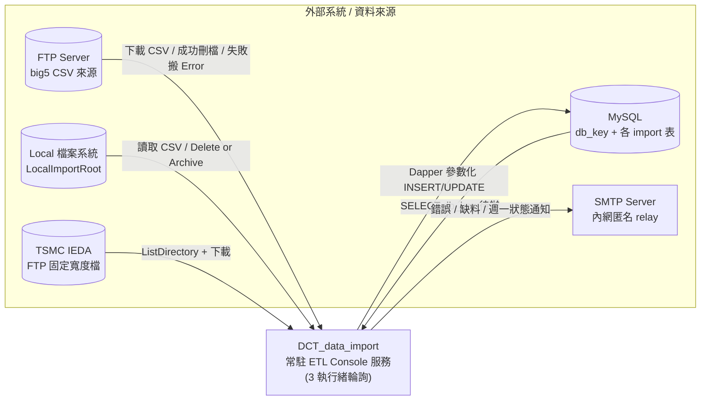
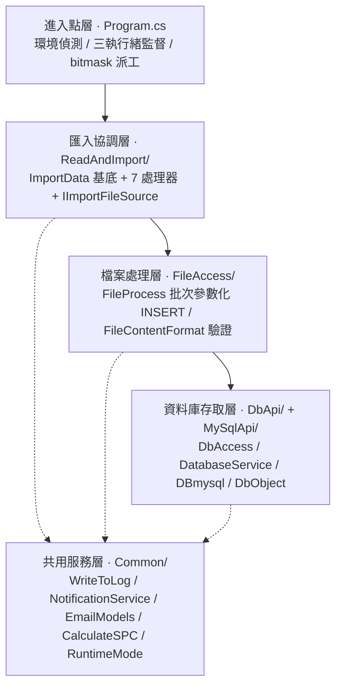
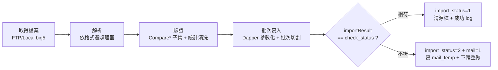
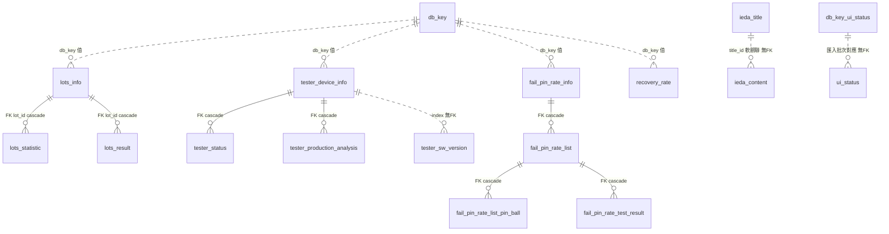
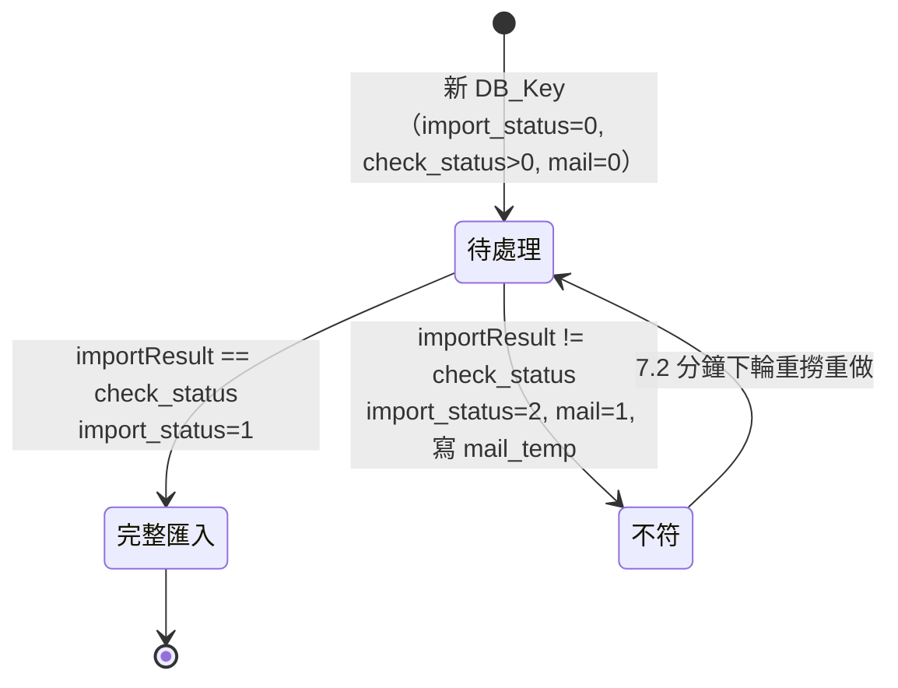
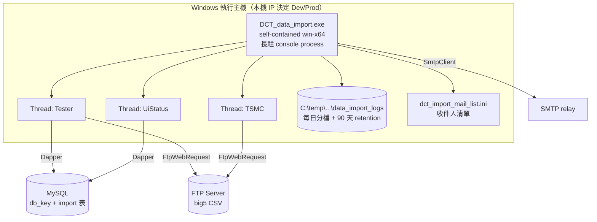

# Architecture

> 本檔的 Mermaid 圖為架構視覺化的**單一真實來源**（GitHub 原生渲染為圖）。`專案架構視覺化.html`（repo 根）為 opt-in 互動衍生產物，其圖表複製自本檔；改架構時更新本檔 Mermaid，HTML 視為衍生（勿手改圖），diagram rot 視同 bug。

## Core Sections (Required)

### 1) Architectural Style

- Primary style：**分層 + 批次輪詢的多執行緒 ETL pipeline**（Layered + polling worker）。
- Why this classification：清楚的三層分工——`Program.cs`（編排）→ `ReadAndImport/*`（業務解析）→ `DbApi`+`MySqlApi`（資料存取）；每層只依賴下層。`Program.Main` 以 3 條長駐 `Thread` 週期性輪詢 `db_key` 旗標表，將 FTP 上的 CSV 拉下、解析、寫入 MySQL（`Program.cs:27-`、`DbApi/DbAccess.cs:85-150`）。
- Primary constraints：
  1. Windows-only（`kernel32` P/Invoke INI、hardcoded `C:\temp` log、FTP 經 `System.Net.FtpWebRequest`）。
  2. 同步阻塞模型——importer 與 DB 存取均為明確同步呼叫;P2 後已移除 fake async 外殼。
  3. 狀態機由 `db_key` 表的 `check_status`（bitmask）/`import_status`/`mail` 欄位驅動，而非程式內狀態。

**系統情境（C4-L1）**：本服務與外部系統的接點（外部系統設定皆來自 `App.config`，細節見 [INTEGRATIONS.md](INTEGRATIONS.md)）。

**分層視圖**：每層只依賴下層；`Common/` 為各層共用（虛線）。模組職責詳見下方 §3 表。

### 2) System Flow

單批 `db_key` 的處理流程（成功/不符分支）：

各步 file-backed 說明：
1. `Program.cs:224` `GetEnvironment()` 偵測環境 → 由 `App.config` 取 DB 連線；`Main`（`:29`）啟動三模式執行緒並監督重啟。
2. `DbApi/DbAccess.cs:85-150` `SelectDbKey(mode)`：以 `SELECT ... WHERE check_status>0 AND import_status=0 AND mail=0` 取得待匯入清單。
3. importer（如 `ReadAndImport/RawData.cs:16`）依 `ImportData.GetFilePath()`（`ReadAndImport/ImportData.cs:225`）組相對路徑，透過 `ImportFileSourceFactory` 選擇 FTP 或 Local 來源，再以 `Encoding.GetEncoding("big5")` 解析。
4. `FileContentFormat`（`FileAccess/FileContentFormat.cs`）的 `CompareInfo()`/`CompareStatistic()` 等做欄位名驗證後，importer 把資料填入 `DataTable`。
5. `FileProcess.Import*`（`FileAccess/FileProcess.cs:81-1392`）把 `DataTable` 轉為 INSERT placeholders + `DynamicParameters`，呼叫 `FileProcess.ExecuteInsert`（`:1414`）→ `DatabaseService.ExecuteCommand` → `DBmysql.ExecuteCommand`；失敗補償 DELETE helper 也走 `ExecuteCommand`。Task 5 後 DB result surface 已是 typed-only。
6. `DbAccess.UpdateDbKeyImportStatus`（`DbApi/DbAccess.cs:188-250`）比對 `importResult == check_status`，相符設 `import_status=1`，否則 `import_status=2` + `mail=1` 並 `WriteToMailTemp`。

### 3) Layer/Module Responsibilities

| Layer or module | Owns | Must not own | Evidence |
|-----------------|------|--------------|----------|
| `Program.cs` | 環境偵測、執行緒監督、依 bitmask 派工 | 解析、SQL | `Program.cs:20,29,198,224` |
| `ReadAndImport/*` | FTP/Local 來源讀取、格式驗證、解析、清理、回傳 `ImportResult` | 連線字串、Dapper | `ReadAndImport/RawData.cs:16`、`ImportData.cs:225`、`ImportFileSource.cs:79` |
| `FileAccess/FileProcess.cs` | DataTable→參數化 INSERT、分批、級聯刪除 | FTP 存取 | `FileProcess.cs:81-1724` |
| `FileAccess/FileContentFormat.cs` | 5 種 CSV 欄位契約 + 1 種 TSMC IEDA 固定寬度 DataTable 契約 + 驗證 | DB / FTP | `FileContentFormat.cs:7,80,139,205,234,278` |
| `DbApi/DatabaseService.cs` | 連線參數驗證、typed `ExecuteQuery`/`ExecuteCommand`、DB/table 存在性檢查 | 業務語意 | `DatabaseService.cs` |
| `MySqlApi/DBmysql.cs` | MySqlConnection 生命週期、Dapper 執行、typed result、錯誤碼對應 | 何時匯入 | `DBmysql.cs` |
| `Common/*` | log（Mutex）、SMTP 寄信、SPC 統計、INI | 匯入流程 | `Common/WriteToLog.cs`、`NotificationService.cs`、`CalculateSPC.cs` |

### 4) Reused Patterns

| Pattern | Where found | Why it exists |
|---------|-------------|---------------|
| Template Method（基底 + 7 子類） | `ReadAndImport/ImportData.cs:13` 基底，`Tester`/`FailPin`/`RawData`… 繼承 | 共用 FTP/路徑/檔案工具，子類各自實作 `ReadAndImport{Type}` |
| Singleton（連線字串） | `MySqlApi/DBmysql.cs:311` `MySqlConnectionManager`（`volatile` + `lock`，只初始化一次） | 全域共用連線字串 |
| Service 包裝 | `DbApi/DatabaseService.cs` 包 `DBmysql` | 統一輸入驗證與錯誤訊息脫敏（`GetSafeErrorMessage`，`:174`） |
| Synchronous DB wrapper | `DbApi/DatabaseService.cs` | DB result surface 為 `ExecuteQuery` / `ExecuteCommand` typed-only |
| Status-flag state machine | `db_key`/`db_key_ui_status` 表的 `check_status`/`import_status`/`mail` | 以 DB 旗標驅動「待處理/已匯入/待寄信」 |

### 5) Known Architectural Risks

- **同步阻塞 I/O 模型**：P2 後已移除 fake async / `.GetAwaiter().GetResult()` active 呼叫;目前仍非真 async / 併發 I/O 設計。若未來要提升 I/O 併發,需另行設計 DB/FTP async path。
- **殘餘動態 SQL 組裝**：S2 已將外部值改為 Dapper parameters；但 `FileProcess` 仍組 table / column / placeholder text，必須維持 `ExecuteInsert` 的 identifier guard，不得新增繞路 SQL。
- **架構文件需持續同步**：本檔 Mermaid 為架構視覺化單一真實來源，根目錄 `專案架構視覺化.html` 為衍生互動產物；後續 module boundary 或 data-flow 變更需同步更新本檔圖與 HTML（diagram rot 視同 bug）。
- **殘餘 placeholder 字串累加**：大型批次路徑已改用 `StringBuilder`，但 `FileProcess` 部分小表/單筆路徑仍有 `values += ...`;若資料量放大到這些路徑,再收斂為 builder。
- **TSMC IEDA importer 流程邊界不一致**：`TsmcIeda.ImportIeda` 仍透過 `FileProcess.ExecuteInsert` / `BuildInsertQuery` 共用 INSERT 與 identifier guard（`TsmcIeda.cs:256,280`），但不走其他 importer 的 `FileProcess.Import*` 逐表方法、且自行以 `DataTable.Select` 過濾；S2 後 INSERT 與 filter value 已做參數化/escaping，流程邊界仍與其他 importer 不一致。
- **DB result surface typed-only**：Task 5 已移除舊 DB result adapter/API surface；SELECT callers 吃 `DbQueryResult`，INSERT/UPDATE/DELETE callers 吃 `DbCommandResult`。DB SQL request DTO 已改為 `DbSqlRequest`。

### 6) Evidence

- `DCT_data_import/Program.cs`
- `DCT_data_import/ReadAndImport/ImportData.cs`、`RawData.cs`、`Tester.cs`、`FailPin.cs`、`RecoveryRate.cs`、`UiStatus.cs`、`MultiSpecRawData.cs`、`TsmcIeda.cs`
- `DCT_data_import/FileAccess/FileProcess.cs`、`FileContentFormat.cs`
- `DCT_data_import/DbApi/DatabaseService.cs`、`DbAccess.cs`、`DbObject.cs`
- `DCT_data_import/MySqlApi/DBmysql.cs`

## Extended Sections (Optional)

- `CheckStatus` bit 語意（已用 `Program.cs` 派工條件交叉驗證，非單純反推）：
  - Bit0(1)=**FailPin**、Bit1(2)=**RawData/TestResult**、Bit2(4)=**Tester**、Bit3(8)=**RecoveryRate**（公式 `importResult = 8*recoveryRate + 4*tester + 2*testResult + failPin`，純函式 `DbAccess.cs:179`；引數順序對應 `Program.cs:482`）。
  - Bit4(16)=**UiStatus** **不在上式內**——走獨立 pipeline（`db_key_ui_status` 表 + `UpdateDbKeyUiStatusImportStatus`，公式 `importResult = uiStatus`，`DbAccess.cs:253`）。把它與 Bit0–3 並列為同一 mask 是概念混用。
  - ✅ **已修復脆弱隱性契約（見 CONCERNS R5，2026-06-27 `fix/r5-checkstatus`）**：上式（純函式 `DbAccess.ComputeImportResult`，`DbAccess.cs:179`）原只在「各 component 的 `Result` 都=1」時才能反推回 `check_status`；但匯入函式 `Result` 實際回 0/1/2/3，任一回 2/3 會讓加權和溢位、污染高位 bit，使 `importResult == check_status`（`DbAccess.cs:221`）恆為 false → 一律判失敗+寄信。**修法**：在 `ComputeImportResult` 內把各分量正規化為 `Result == 1 ? 1 : 0`（明確排除 `Math.Min`——它會把失敗碼 2/3 也映成 1、反把失敗當成功），0/1 輸入行為不變、僅修正 ≥2 溢位；`DCT_data_import.Tests` 3 條 `_R5` 回歸樁轉綠並移除 `ByDesignRed` trait、重納 CI gate。
  - [ASK USER] 對照正式規格確認：bit 定義、各 component 合法值域（是否該只存 0/1）、UiStatus 是否本就獨立、成功判定是否要求「全數成功」。

### 資料模型（Data Model）

**實線=FK `on delete cascade`；虛線=僅靠 index/欄位值的軟關聯（無 FK，刪父表不會自動連帶）。** 完整 DDL 見 [`DCT_data_import/sql/dct.sql`](../../DCT_data_import/sql/dct.sql)。無 FK cascade 的子表（`tester_sw_version` / `ieda_content` / `ui_status`）父表刪除**不自動連帶**，回滾完全依賴 app 端 DELETE 順序（見 CONCERNS R 段與「best-effort cascade DELETE」）。`db_key` 是所有匯入根表的邏輯關聯鍵（每張根表帶 `db_key` 欄位回指控制表，非 FK）。

### db_key 狀態機

控制表 `db_key` 的狀態在 DB 不在程式（`check_status` / `import_status` / `mail` 欄位驅動）。不符的批次在下一輪（約 7.2 分鐘）重撈重做。

### 部署拓樸（Deployment）

`dotnet publish -c Release -r win-x64 --self-contained true` 產 self-contained exe，部署 Windows 主機後**直接執行 exe**（長駐 console process）；**未發現 Windows Service / 工作排程器安裝程式**，守護由程式自身三執行緒監督。環境路由靠本機 IP（命中 `10.16.92.67/68`→Prod，否則 Dev），同一 binary 跨環境；輪詢約每 7.2 分鐘一輪、錯誤退避 30 秒。

