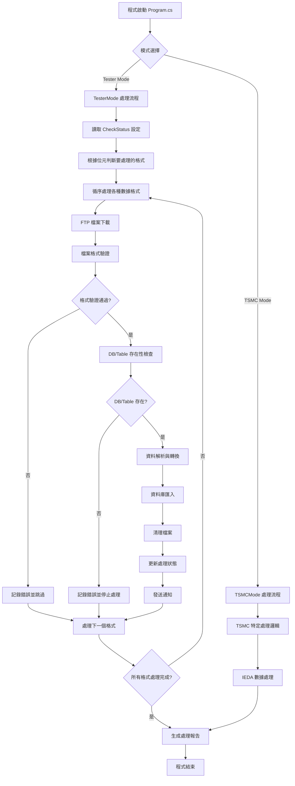

# DCT Data Import 專案架構報告

## 📋 專案概述

**專案名稱**: DCT Data Import System  
**專案類型**: C# .NET Framework 4.6.2 Console Application  
**主要功能**: 自動化處理 DCT (Direct Circuit Test) 測試數據的導入與管理系統  
**核心架構**: 三層式架構 (Presentation → Business Logic → Data Access)

## 🏗️ 系統架構分析

### 架構設計模式

```
┌─────────────────────────────────────────────────────────────┐
│                    DCT Data Import System                   │
├─────────────────────────────────────────────────────────────┤
│  Presentation Layer (程式進入點)                            │
│  ├── Program.cs - 主要控制邏輯                             │
│  ├── Configuration Management - 配置管理                   │
│  └── Mode Selection (Tester/TSMC) - 模式選擇              │
├─────────────────────────────────────────────────────────────┤
│  Business Logic Layer (業務邏輯層)                         │
│  ├── ReadAndImport/ - 數據處理核心模組                     │
│  ├── FileAccess/ - 檔案處理模組                           │
│  └── Common/ - 共用功能模組                               │
├─────────────────────────────────────────────────────────────┤
│  Data Access Layer (資料存取層)                            │
│  ├── DbApi/ - 統一資料庫API接口                           │
│  ├── MySQL_api/ - MySQL專用操作                           │
│  └── DatabaseSchemaDefinitions/ - 資料表結構定義          │
├─────────────────────────────────────────────────────────────┤
│  External Systems (外部系統)                               │
│  ├── FTP Server - 數據源頭                                │
│  ├── MySQL Database - 數據儲存                            │
│  └── HTTP API Service - 第三方API服務                     │
└─────────────────────────────────────────────────────────────┘
```

### 核心元件架構

#### 1. 數據處理核心 (ReadAndImport/)

**目前支援的數據格式 (6 種)**:

1. **RecoveryRate** - 恢復率數據

   - 檔案格式: RecoveryRateDataContentFormat
   - 處理器: RecoveryRate.cs / RecoveryRateRefactored.cs
   - 資料庫表: `recovery_rate`

2. **RawData** - 原始測試數據

   - 檔案格式: RawDataContentFormat
   - 處理器: RawData.cs / RawDataRefactored.cs
   - 資料庫表: `lots_info`, `lots_statistic`, `lots_result`

3. **TsmcIeda** - TSMC IEDA 數據

   - 檔案格式: IedaDataFormat
   - 處理器: TsmcIeda.cs / TsmcIedaRefactored.cs
   - 資料庫表: `ieda_title`, `ieda_content`

4. **Tester** - 測試器狀態數據

   - 檔案格式: TestStatusContentFormat
   - 處理器: Tester.cs / TesterRefactored.cs
   - 資料庫表: `tester_device_info`, `tester_status`, `tester_sw_version`

5. **FailPin** - 故障針腳數據

   - 檔案格式: FailPinLogContentFormat
   - 處理器: FailPin.cs / FailPinRefactored.cs
   - 資料庫表: `fail_pin_rate_info`, `fail_pin_rate_list`, `fail_pin_rate_test_result`

6. **UiStatus** - UI 狀態數據
   - 檔案格式: UIStatusContentFormat
   - 處理器: UiStatus.cs / UiStatusRefactored.cs
   - 資料庫表: `ui_status`

#### 2. 檔案格式定義系統 (FileContentFormat.cs)

**檔案格式架構模式**:

```csharp
public class [FormatName]ContentFormat
{
    // 1. 欄位定義區段
    private static readonly string[] _[category]Columns = {
        "column1", "column2", "column3", ...
    };

    // 2. DataTable 屬性
    public DataTable [CategoryName] { get; set; }

    // 3. 初始化方法
    public [FormatName]ContentFormat()
    {
        InitializeDataTables();
    }

    // 4. DataTable 結構建立
    private void InitializeDataTables()
    {
        [CategoryName] = CreateDataTable(_[category]Columns);
    }

    // 5. 驗證方法
    public bool Compare[Category](DataTable sourceTable)
    {
        return CompareColumns(sourceTable, _[category]Columns);
    }
}
```

#### 3. 資料庫處理架構 (DbApi/)

**資料庫操作層級**:

1. **DatabaseSchemaDefinitions.cs** - 資料表結構定義

   - 管理所有資料表的 CREATE TABLE SQL
   - 統一的資料表創建接口

2. **DatabaseService.cs** - 資料庫服務層

   - 連接管理與健康檢查
   - 統一的查詢執行接口
   - **DB/Table 存在性檢查機制** (CheckDatabaseAndTableExists)
   - 資料庫和資料表自動創建功能 (EnsureDatabaseExistsAsync/EnsureTableExistsAsync)

3. **DbAccess.cs** - 資料存取層

   - 具體的資料庫操作實現
   - 連接池管理

4. **FileProcess.cs** - 檔案與資料庫橋接層
   - 格式驗證與資料轉換
   - 專用的匯入方法
   - **實作 DB/Table 檢查邏輯**，確保資料完整性

## 🔄 專案運作流程說明

### 整體系統運作架構



### 核心處理流程詳解

#### 1. 程式初始化階段

```csharp
// Program.cs 主要流程
static void Main(string[] args)
{
    // 1. 讀取配置檔案 (App.config)
    // 2. 初始化資料庫連接參數
    // 3. 設定日誌系統
    // 4. 判斷執行模式 (Tester/TSMC)
    // 5. 開始數據處理流程
}
```

#### 2. 數據格式處理流程 (以 Tester Mode 為例)

**CheckStatus 位元控制機制**:

```
CheckStatus 位元定義:
- Bit 0 (1):  RecoveryRate 數據
- Bit 1 (2):  RawData 原始測試數據
- Bit 2 (4):  Tester 狀態數據
- Bit 3 (8):  FailPin 故障針腳數據
- Bit 4 (16): UiStatus UI狀態數據

範例: CheckStatus = 31 表示處理所有格式 (1+2+4+8+16)
```

**單一格式處理步驟**:

```csharp
foreach (DataFormat format in EnabledFormats)
{
    // 步驟 1: FTP 檔案下載
    string filePath = await DownloadFromFtp(format.FileName);

    // 步驟 2: 檔案格式驗證
    bool isValid = ValidateFileFormat(filePath, format.ExpectedFormat);

    // 步驟 3: DB/Table 存在性檢查 (新增機制)
    bool dbExists = DatabaseService.CheckDatabaseAndTableExists(format.TableName);
    if (!dbExists) {
        LogError($"資料庫或資料表 {format.TableName} 不存在");
        continue; // 跳過此格式，不自動創建
    }

    // 步驟 4: 資料解析
    var parsedData = ParseFileContent(filePath, format);

    // 步驟 5: 資料庫匯入
    bool importSuccess = ImportToDatabase(parsedData, format.TableName);

    // 步驟 6: 清理與狀態更新
    CleanupFiles(filePath);
    UpdateProcessingStatus(format, importSuccess);
}
```

#### 3. DB/Table 存在性檢查機制 (2025-08-12 新增)

**檢查模式 vs 自動創建模式對比**:

| 機制         | 舊版 (自動創建)                                      | 新版 (檢查模式)             |
| ------------ | ---------------------------------------------------- | --------------------------- |
| **行為**     | 不存在時自動創建                                     | 不存在時報錯停止            |
| **方法**     | EnsureDatabaseExistsAsync<br/>EnsureTableExistsAsync | CheckDatabaseAndTableExists |
| **安全性**   | 中等 (可能創建意外資源)                              | 高 (明確控制)               |
| **適用場景** | 開發測試環境                                         | 生產環境                    |

**實作位置**:

```csharp
// DatabaseService.cs - 新增方法
public bool CheckDatabaseAndTableExists(string tableName)
{
    // 使用 INFORMATION_SCHEMA 快速檢查
    // 只檢查，不創建任何資源
    // 包含完整錯誤處理和日誌記錄
}

// 使用位置 (已更新 13 個位置):
// - FileProcess.cs: 4 個使用點
// - DbAccess.cs: 5 個使用點
// - FileProcessRefactored.cs: 2 個使用點
// - Program.cs: 2 個使用點 (備份中)
```

#### 4. 資料庫操作流程

**資料匯入標準流程**:

```csharp
public bool ImportDataFormat(ContentFormat content, string dbKey)
{
    try
    {
        // 1. 檢查 DB/Table 存在性 (必要步驟)
        if (!DatabaseService.CheckDatabaseAndTableExists(tableName))
        {
            WriteToLog.WriteErrorLog($"資料庫或資料表 {tableName} 不存在");
            return false;
        }

        // 2. 檢查 DB Key 是否已存在 (避免重複匯入)
        if (IsDBKeyExistInDB(tableName, dbKey))
        {
            WriteToLog.WriteToDataImportLog("資料已存在，跳過匯入");
            return true;
        }

        // 3. 資料轉換與驗證
        var validatedData = ValidateAndTransformData(content);

        // 4. 執行資料庫匯入
        var result = ExecuteInsertWithAPI(tableName, columns, values);

        // 5. 記錄匯入結果
        LogImportResult(result, tableName, dbKey);

        return string.IsNullOrEmpty(result.Error);
    }
    catch (Exception ex)
    {
        WriteToLog.WriteErrorLog($"匯入失敗: {ex.Message}");
        return false;
    }
}
```

### 錯誤處理與恢復機制

#### 1. 分級錯誤處理

- **嚴重錯誤**: DB 連接失敗 → 程式終止
- **格式錯誤**: 檔案格式不符 → 跳過該檔案，繼續處理
- **資源錯誤**: DB/Table 不存在 → 記錄錯誤，不自動創建
- **資料錯誤**: 資料驗證失敗 → 記錄詳細錯誤訊息

#### 2. 日誌記錄機制

```csharp
// WriteToLog.cs 提供多種日誌級別
WriteToDataImportLog(message);    // 一般處理訊息
WriteErrorLog(errorMessage);      // 錯誤訊息
WriteDebugLog(debugInfo);         // 除錯訊息
```

#### 3. 通知機制

- **成功通知**: 所有格式處理完成後發送成功報告
- **錯誤通知**: 發生嚴重錯誤時立即發送警報
- **狀態更新**: 更新 `db_key` 和 `db_key_ui_status` 表的處理狀態

## 🔧 現行檔案欄位擴充實作指南

### 步驟 1: 識別擴充需求

**分析目標**:

- 確認要擴充的檔案格式類型
- 識別新增欄位的資料類型與驗證規則
- 評估對現有資料的相容性影響

### 步驟 2: 修改檔案格式定義

**FileContentFormat.cs 修改範例**:

```csharp
// 以 RecoveryRateDataContentFormat 為例
public class RecoveryRateDataContentFormat
{
    // 原有欄位定義
    private static readonly string[] _infoColumns = {
        "Area", "Factory", "OSMachine", "Customer", "Program",
        "AOLot", "Mode", "Date", "TestItem", "DefectMode"
        // 新增欄位在此處添加
        , "NewField1", "NewField2", "NewField3"
    };

    private static readonly string[] _statusColumns = {
        "Area", "Factory", "OSMachine", "Customer", "Date",
        "ReTestPass", "FailPinCount", "TotalUnit", "RecoveryRate"
        // 新增欄位在此處添加
        , "NewStatusField1", "NewStatusField2"
    };

    // 其餘結構保持不變...
}
```

### 步驟 3: 更新資料庫結構定義

**DatabaseSchemaDefinitions.cs 修改範例**:

```csharp
private static string GetRecoveryRateTableSql()
{
    return @"CREATE TABLE IF NOT EXISTS `recovery_rate` (
            `id` int(11) NOT NULL AUTO_INCREMENT,
            // ... 原有欄位 ...

            // 新增欄位定義
            `new_field1` varchar(255) DEFAULT NULL,
            `new_field2` decimal(10,2) DEFAULT 0.00,
            `new_field3` datetime DEFAULT NULL,

            `created_at` timestamp NULL DEFAULT CURRENT_TIMESTAMP,
            PRIMARY KEY (`id`),
            // 原有索引
            KEY `idx_db_key` (`db_key`),
            // 新增索引 (如需要)
            KEY `idx_new_field1` (`new_field1`)
        ) ENGINE=InnoDB DEFAULT CHARSET=utf8mb4 COLLATE=utf8mb4_unicode_ci";
}
```

### 步驟 4: 實作資料庫遷移

**新增資料庫遷移方法**:

```csharp
// 在 DatabaseService.cs 或專用的 Migration 類別中
public class DatabaseMigration
{
    public bool MigrateRecoveryRateTable()
    {
        var alterSqls = new[]
        {
            "ALTER TABLE `recovery_rate` ADD COLUMN `new_field1` varchar(255) DEFAULT NULL",
            "ALTER TABLE `recovery_rate` ADD COLUMN `new_field2` decimal(10,2) DEFAULT 0.00",
            "ALTER TABLE `recovery_rate` ADD COLUMN `new_field3` datetime DEFAULT NULL",
            "ALTER TABLE `recovery_rate` ADD INDEX `idx_new_field1` (`new_field1`)"
        };

        foreach (var sql in alterSqls)
        {
            try
            {
                var result = ExecuteNonQuery(sql);
                if (!string.IsNullOrEmpty(result.Error))
                {
                    WriteToLog.WriteErrorLog($"Migration failed: {result.Error}");
                    return false;
                }
            }
            catch (Exception ex)
            {
                WriteToLog.WriteErrorLog($"Migration exception: {ex.Message}");
                return false;
            }
        }
        return true;
    }
}
```

### 步驟 5: 修改資料處理邏輯

**更新對應的處理器 (以 RecoveryRate 為例)**:

```csharp
// RecoveryRate.cs 或 RecoveryRateRefactored.cs
private RecoveryRateDataContentFormat FileReadRecoveryRateData(StreamReader reader)
{
    // 檔案讀取邏輯保持不變
    // 新增欄位會自動透過 FileContentFormat 的驗證機制處理

    // 如需特殊處理邏輯，在此添加
    foreach (DataRow row in content.Info.Rows)
    {
        // 新增欄位的資料處理邏輯
        if (row["NewField1"] != DBNull.Value)
        {
            // 特殊處理邏輯
            row["NewField1"] = ProcessNewField1(row["NewField1"].ToString());
        }
    }
}
```

### 步驟 6: 更新匯入方法

**FileProcess.cs 修改**:

```csharp
public bool ImportRecoveryRateData(RecoveryRateDataContentFormat content,
                                   DatabaseService DatabaseService, string dbKey)
{
    // 現有邏輯保持不變
    // 新增欄位會自動包含在動態 column 建構中

    // 如需特殊的欄位處理，可以在此處添加
    for (int i = 0; i < content.Info.Columns.Count; i++)
    {
        string columnName = content.Info.Columns[i].ColumnName.Trim();

        // 新增欄位的特殊轉換邏輯
        if (columnName == "NewField1")
        {
            // 特殊處理邏輯
            values += "'" + ConvertSpecialFormat(content.Info.Rows[0][i].ToString()) + "'";
        }
        else
        {
            // 原有處理邏輯
            values += "'" + ConvertEmptyToDefaultString(content.Info.Rows[0][i].ToString()) + "'";
        }
    }
}
```

### 步驟 7: 測試與驗證

**測試檢查清單**:

```
□ 新欄位的檔案格式驗證是否正確
□ 資料庫結構是否成功更新
□ 資料匯入是否包含新欄位
□ 新欄位的資料類型轉換是否正確
□ 向後相容性測試 (舊檔案格式仍可處理)
□ 效能測試 (新欄位不影響處理速度)
□ 錯誤處理測試 (新欄位的異常狀況)
```

## 🆕 全新檔案格式實作指南

### 步驟 1: 分析新格式需求

**需求分析模板**:

```
格式名稱: [NewFormat]
數據來源: [FTP路徑/檔案命名規則]
檔案結構: [固定欄位/動態欄位/多區段結構]
資料類型: [各欄位的資料類型定義]
驗證規則: [必填欄位/格式驗證/範圍驗證]
處理頻率: [即時/批次/排程]
```

### 步驟 2: 建立新的檔案格式類別

**FileContentFormat.cs 新增**:

```csharp
public class NewFormatContentFormat
{
    // 1. 定義欄位群組
    private static readonly string[] _headerColumns = {
        "FormatVersion", "Timestamp", "MachineId", "Operator"
    };

    private static readonly string[] _dataColumns = {
        "TestId", "Value", "Unit", "Status", "Timestamp"
    };

    private static readonly string[] _summaryColumns = {
        "TotalTests", "PassCount", "FailCount", "Duration"
    };

    // 2. DataTable 屬性
    public DataTable Header { get; set; }
    public DataTable TestData { get; set; }
    public DataTable Summary { get; set; }

    // 3. 建構函式
    public NewFormatContentFormat()
    {
        InitializeDataTables();
    }

    // 4. 初始化 DataTable
    private void InitializeDataTables()
    {
        Header = CreateDataTable(_headerColumns);
        TestData = CreateDataTable(_dataColumns);
        Summary = CreateDataTable(_summaryColumns);
    }

    // 5. 欄位驗證方法
    public bool CompareHeader(DataTable sourceTable)
    {
        return CompareColumns(sourceTable, _headerColumns);
    }

    public bool CompareTestData(DataTable sourceTable)
    {
        return CompareColumns(sourceTable, _dataColumns);
    }

    public bool CompareSummary(DataTable sourceTable)
    {
        return CompareColumns(sourceTable, _summaryColumns);
    }

    // 6. 共用驗證邏輯
    private bool CompareColumns(DataTable sourceTable, string[] expectedColumns)
    {
        if (sourceTable?.Columns == null) return false;

        foreach (string expectedColumn in expectedColumns)
        {
            if (!sourceTable.Columns.Contains(expectedColumn))
            {
                return false;
            }
        }
        return true;
    }

    // 7. 共用 DataTable 建立邏輯
    private DataTable CreateDataTable(string[] columns)
    {
        DataTable table = new DataTable();
        foreach (string column in columns)
        {
            table.Columns.Add(column, typeof(string));
        }
        return table;
    }
}
```

### 步驟 3: 定義資料庫結構

**DatabaseSchemaDefinitions.cs 新增**:

```csharp
// 在 GetTableDefinitions() 中新增
private static Dictionary<string, string> GetTableDefinitions()
{
    return new Dictionary<string, string>
    {
        // ... 現有定義 ...

        // 新格式的資料表定義
        ["new_format_header"] = GetNewFormatHeaderTableSql(),
        ["new_format_data"] = GetNewFormatDataTableSql(),
        ["new_format_summary"] = GetNewFormatSummaryTableSql()
    };
}

// 新格式的資料表結構定義
private static string GetNewFormatHeaderTableSql()
{
    return @"CREATE TABLE IF NOT EXISTS `new_format_header` (
            `id` int(11) NOT NULL AUTO_INCREMENT,
            `db_key` varchar(255) NOT NULL,
            `format_version` varchar(50) DEFAULT NULL,
            `timestamp` datetime DEFAULT NULL,
            `machine_id` varchar(100) DEFAULT NULL,
            `operator` varchar(100) DEFAULT NULL,
            `created_at` timestamp NULL DEFAULT CURRENT_TIMESTAMP,
            PRIMARY KEY (`id`),
            KEY `idx_db_key` (`db_key`),
            KEY `idx_machine_id` (`machine_id`),
            KEY `idx_timestamp` (`timestamp`)
        ) ENGINE=InnoDB DEFAULT CHARSET=utf8mb4 COLLATE=utf8mb4_unicode_ci";
}

private static string GetNewFormatDataTableSql()
{
    return @"CREATE TABLE IF NOT EXISTS `new_format_data` (
            `id` int(11) NOT NULL AUTO_INCREMENT,
            `header_id` int(11) NOT NULL,
            `test_id` varchar(255) DEFAULT NULL,
            `value` decimal(15,6) DEFAULT NULL,
            `unit` varchar(50) DEFAULT NULL,
            `status` varchar(20) DEFAULT NULL,
            `test_timestamp` datetime DEFAULT NULL,
            `created_at` timestamp NULL DEFAULT CURRENT_TIMESTAMP,
            PRIMARY KEY (`id`),
            KEY `idx_header_id` (`header_id`),
            KEY `idx_test_id` (`test_id`),
            KEY `idx_status` (`status`),
            FOREIGN KEY (`header_id`) REFERENCES `new_format_header`(`id`) ON DELETE CASCADE
        ) ENGINE=InnoDB DEFAULT CHARSET=utf8mb4 COLLATE=utf8mb4_unicode_ci";
}

private static string GetNewFormatSummaryTableSql()
{
    return @"CREATE TABLE IF NOT EXISTS `new_format_summary` (
            `id` int(11) NOT NULL AUTO_INCREMENT,
            `header_id` int(11) NOT NULL,
            `total_tests` int(11) DEFAULT 0,
            `pass_count` int(11) DEFAULT 0,
            `fail_count` int(11) DEFAULT 0,
            `duration` decimal(10,3) DEFAULT NULL,
            `created_at` timestamp NULL DEFAULT CURRENT_TIMESTAMP,
            PRIMARY KEY (`id`),
            KEY `idx_header_id` (`header_id`),
            FOREIGN KEY (`header_id`) REFERENCES `new_format_header`(`id`) ON DELETE CASCADE
        ) ENGINE=InnoDB DEFAULT CHARSET=utf8mb4 COLLATE=utf8mb4_unicode_ci";
}
```

### 步驟 4: 建立新格式處理器

**ReadAndImport/NewFormat.cs**:

```csharp
using System;
using System.IO;
using System.Threading.Tasks;
using DCT_data_import.DbApi;
using DCT_data_import.FileAccess;
using static DCT_data_import.DbObject;

namespace DCT_data_import.ReadAndImport
{
    public class NewFormat : ImportData
    {
        private readonly WriteToLog _writeToLog = new WriteToLog();

        // 主要處理方法
        public async Task<ImportResult> ReadAndImportNewFormat(
            FileProcess fileAccess,
            DatabaseService databaseService,
            string dbKey)
        {
            ImportResult result = new ImportResult { IsSuccess = false };

            try
            {
                // 1. 從 FTP 下載檔案
                string fileName = $"{dbKey}_newformat.txt";
                string localFilePath = await DownloadFileFromFtp(fileName);

                if (string.IsNullOrEmpty(localFilePath))
                {
                    result.ErrorMessage = "檔案下載失敗";
                    return result;
                }

                // 2. 讀取並解析檔案
                NewFormatContentFormat content;
                using (StreamReader reader = new StreamReader(localFilePath))
                {
                    content = FileReadNewFormat(reader);
                }

                // 3. 驗證檔案格式
                if (!ValidateFileContent(content))
                {
                    result.ErrorMessage = "檔案格式驗證失敗";
                    return result;
                }

                // 4. 匯入資料庫
                bool importSuccess = await ImportNewFormatData(content, databaseService, dbKey);

                if (importSuccess)
                {
                    result.IsSuccess = true;
                    result.Message = "新格式資料匯入成功";

                    // 5. 清理 FTP 檔案
                    DeleteFile(fileName);
                }
                else
                {
                    result.ErrorMessage = "資料庫匯入失敗";
                }

                // 6. 清理本地檔案
                if (File.Exists(localFilePath))
                {
                    File.Delete(localFilePath);
                }
            }
            catch (Exception ex)
            {
                _writeToLog.WriteErrorLog($"ReadAndImportNewFormat error: {ex.Message}");
                result.ErrorMessage = ex.Message;
            }

            return result;
        }

        // 檔案讀取與解析
        private NewFormatContentFormat FileReadNewFormat(StreamReader reader)
        {
            NewFormatContentFormat content = new NewFormatContentFormat();

            try
            {
                string line;
                string currentSection = "";

                while ((line = reader.ReadLine()) != null)
                {
                    line = line.Trim();

                    // 判斷區段
                    if (line.StartsWith("[HEADER]"))
                    {
                        currentSection = "HEADER";
                        continue;
                    }
                    else if (line.StartsWith("[DATA]"))
                    {
                        currentSection = "DATA";
                        continue;
                    }
                    else if (line.StartsWith("[SUMMARY]"))
                    {
                        currentSection = "SUMMARY";
                        continue;
                    }

                    // 解析資料行
                    if (!string.IsNullOrEmpty(line) && !line.StartsWith("#"))
                    {
                        ParseDataLine(content, currentSection, line);
                    }
                }
            }
            catch (Exception ex)
            {
                _writeToLog.WriteErrorLog($"FileReadNewFormat error: {ex.Message}");
            }

            return content;
        }

        // 解析單行資料
        private void ParseDataLine(NewFormatContentFormat content, string section, string line)
        {
            string[] fields = line.Split('\t');

            switch (section)
            {
                case "HEADER":
                    if (fields.Length >= 4)
                    {
                        var headerRow = content.Header.NewRow();
                        headerRow["FormatVersion"] = fields[0];
                        headerRow["Timestamp"] = fields[1];
                        headerRow["MachineId"] = fields[2];
                        headerRow["Operator"] = fields[3];
                        content.Header.Rows.Add(headerRow);
                    }
                    break;

                case "DATA":
                    if (fields.Length >= 5)
                    {
                        var dataRow = content.TestData.NewRow();
                        dataRow["TestId"] = fields[0];
                        dataRow["Value"] = fields[1];
                        dataRow["Unit"] = fields[2];
                        dataRow["Status"] = fields[3];
                        dataRow["Timestamp"] = fields[4];
                        content.TestData.Rows.Add(dataRow);
                    }
                    break;

                case "SUMMARY":
                    if (fields.Length >= 4)
                    {
                        var summaryRow = content.Summary.NewRow();
                        summaryRow["TotalTests"] = fields[0];
                        summaryRow["PassCount"] = fields[1];
                        summaryRow["FailCount"] = fields[2];
                        summaryRow["Duration"] = fields[3];
                        content.Summary.Rows.Add(summaryRow);
                    }
                    break;
            }
        }

        // 檔案內容驗證
        private bool ValidateFileContent(NewFormatContentFormat content)
        {
            try
            {
                // 檢查必要區段是否存在
                if (content.Header.Rows.Count == 0)
                {
                    _writeToLog.WriteErrorLog("新格式檔案缺少 HEADER 區段");
                    return false;
                }

                if (content.TestData.Rows.Count == 0)
                {
                    _writeToLog.WriteErrorLog("新格式檔案缺少 DATA 區段");
                    return false;
                }

                // 驗證 HEADER 資料
                var headerRow = content.Header.Rows[0];
                if (string.IsNullOrEmpty(headerRow["MachineId"].ToString()))
                {
                    _writeToLog.WriteErrorLog("HEADER 區段缺少 MachineId");
                    return false;
                }

                // 驗證 DATA 資料
                foreach (DataRow dataRow in content.TestData.Rows)
                {
                    if (string.IsNullOrEmpty(dataRow["TestId"].ToString()))
                    {
                        _writeToLog.WriteErrorLog("DATA 區段存在缺少 TestId 的記錄");
                        return false;
                    }

                    // 驗證數值格式
                    if (!string.IsNullOrEmpty(dataRow["Value"].ToString()))
                    {
                        if (!decimal.TryParse(dataRow["Value"].ToString(), out _))
                        {
                            _writeToLog.WriteErrorLog($"DATA 區段的 Value 格式錯誤: {dataRow["Value"]}");
                            return false;
                        }
                    }
                }

                return true;
            }
            catch (Exception ex)
            {
                _writeToLog.WriteErrorLog($"ValidateFileContent error: {ex.Message}");
                return false;
            }
        }

        // 資料庫匯入
        private async Task<bool> ImportNewFormatData(
            NewFormatContentFormat content,
            DatabaseService databaseService,
            string dbKey)
        {
            FileProcess fileProcess = new FileProcess();

            try
            {
                // 1. 匯入 Header
                int headerId = await ImportHeader(content, databaseService, dbKey, fileProcess);
                if (headerId <= 0)
                {
                    return false;
                }

                // 2. 匯入 TestData
                bool dataImported = await ImportTestData(content, databaseService, headerId, fileProcess);
                if (!dataImported)
                {
                    return false;
                }

                // 3. 匯入 Summary
                bool summaryImported = await ImportSummary(content, databaseService, headerId, fileProcess);
                return summaryImported;
            }
            catch (Exception ex)
            {
                _writeToLog.WriteErrorLog($"ImportNewFormatData error: {ex.Message}");
                return false;
            }
        }

        // 匯入 Header 並返回 ID
        private async Task<int> ImportHeader(
            NewFormatContentFormat content,
            DatabaseService databaseService,
            string dbKey,
            FileProcess fileProcess)
        {
            try
            {
                var headerRow = content.Header.Rows[0];

                string columns = "`db_key`,`format_version`,`timestamp`,`machine_id`,`operator`";
                string values = $"'{dbKey}'," +
                              $"'{fileProcess.ConvertEmptyToDefaultString(headerRow["FormatVersion"].ToString())}'," +
                              $"'{fileProcess.ConvertEmptyToDefaultString(headerRow["Timestamp"].ToString())}'," +
                              $"'{fileProcess.ConvertEmptyToDefaultString(headerRow["MachineId"].ToString())}'," +
                              $"'{fileProcess.ConvertEmptyToDefaultString(headerRow["Operator"].ToString())}'";

                var response = fileProcess.ExecuteInsertWithAPI(databaseService, "new_format_header", columns, values);

                if (!string.IsNullOrEmpty(response.Error))
                {
                    _writeToLog.WriteErrorLog($"ImportHeader error: {response.Error}");
                    return 0;
                }

                // 取得剛插入的 ID
                var selectResponse = fileProcess.ExecuteSelectWithAPI(databaseService,
                    "SELECT id FROM new_format_header WHERE db_key = '" + dbKey + "' ORDER BY id DESC LIMIT 1");

                if (selectResponse.DataTable?.Rows.Count > 0)
                {
                    return Convert.ToInt32(selectResponse.DataTable.Rows[0]["id"]);
                }

                return 0;
            }
            catch (Exception ex)
            {
                _writeToLog.WriteErrorLog($"ImportHeader exception: {ex.Message}");
                return 0;
            }
        }

        // 匯入測試資料
        private async Task<bool> ImportTestData(
            NewFormatContentFormat content,
            DatabaseService databaseService,
            int headerId,
            FileProcess fileProcess)
        {
            try
            {
                if (content.TestData.Rows.Count == 0)
                {
                    return true; // 沒有資料不算錯誤
                }

                string columns = "`header_id`,`test_id`,`value`,`unit`,`status`,`test_timestamp`";
                string allValues = "";

                for (int i = 0; i < content.TestData.Rows.Count; i++)
                {
                    var dataRow = content.TestData.Rows[i];

                    string values = $"'{headerId}'," +
                                  $"'{fileProcess.ConvertEmptyToDefaultString(dataRow["TestId"].ToString())}'," +
                                  $"'{fileProcess.ConvertEmptyToDefaultString(dataRow["Value"].ToString())}'," +
                                  $"'{fileProcess.ConvertEmptyToDefaultString(dataRow["Unit"].ToString())}'," +
                                  $"'{fileProcess.ConvertEmptyToDefaultString(dataRow["Status"].ToString())}'," +
                                  $"'{fileProcess.ConvertEmptyToDefaultString(dataRow["Timestamp"].ToString())}'";

                    allValues += $"({values})";
                    if (i < content.TestData.Rows.Count - 1)
                    {
                        allValues += ",";
                    }
                }

                var response = fileProcess.ExecuteInsertWithAPI(databaseService, "new_format_data", columns, allValues);

                if (!string.IsNullOrEmpty(response.Error))
                {
                    _writeToLog.WriteErrorLog($"ImportTestData error: {response.Error}");
                    return false;
                }

                return true;
            }
            catch (Exception ex)
            {
                _writeToLog.WriteErrorLog($"ImportTestData exception: {ex.Message}");
                return false;
            }
        }

        // 匯入摘要資料
        private async Task<bool> ImportSummary(
            NewFormatContentFormat content,
            DatabaseService databaseService,
            int headerId,
            FileProcess fileProcess)
        {
            try
            {
                if (content.Summary.Rows.Count == 0)
                {
                    return true; // 沒有摘要不算錯誤
                }

                var summaryRow = content.Summary.Rows[0];

                string columns = "`header_id`,`total_tests`,`pass_count`,`fail_count`,`duration`";
                string values = $"'{headerId}'," +
                              $"'{fileProcess.ConvertEmptyToDefaultString(summaryRow["TotalTests"].ToString())}'," +
                              $"'{fileProcess.ConvertEmptyToDefaultString(summaryRow["PassCount"].ToString())}'," +
                              $"'{fileProcess.ConvertEmptyToDefaultString(summaryRow["FailCount"].ToString())}'," +
                              $"'{fileProcess.ConvertEmptyToDefaultString(summaryRow["Duration"].ToString())}'";

                var response = fileProcess.ExecuteInsertWithAPI(databaseService, "new_format_summary", columns, values);

                if (!string.IsNullOrEmpty(response.Error))
                {
                    _writeToLog.WriteErrorLog($"ImportSummary error: {response.Error}");
                    return false;
                }

                return true;
            }
            catch (Exception ex)
            {
                _writeToLog.WriteErrorLog($"ImportSummary exception: {ex.Message}");
                return false;
            }
        }

        // FTP 檔案下載 (繼承自 ImportData 基底類別的輔助方法)
        private async Task<string> DownloadFileFromFtp(string fileName)
        {
            // 實作 FTP 下載邏輯
            // 這裡可以參考其他處理器的實作方式
            try
            {
                // 實際的 FTP 下載實作...
                string localPath = Path.Combine(Path.GetTempPath(), fileName);

                // 下載邏輯實作...

                return localPath;
            }
            catch (Exception ex)
            {
                _writeToLog.WriteErrorLog($"DownloadFileFromFtp error: {ex.Message}");
                return "";
            }
        }
    }
}
```

### 步驟 5: 整合到主程式流程

**Program.cs 修改**:

```csharp
// 在適當的處理邏輯中加入新格式的處理
static string ImportTesterMode(...)
{
    // ... 現有邏輯 ...

    // 新增新格式處理
    if ((CheckStatus & 32) == 32) // 假設使用 bit 5 代表新格式
    {
        NewFormat newFormatProcessor = new NewFormat();
        var newFormatResult = await newFormatProcessor.ReadAndImportNewFormat(
            fileAccess, DatabaseService, DbKey);

        if (newFormatResult.IsSuccess)
        {
            resultMessages.Add("新格式資料匯入成功");
        }
        else
        {
            resultMessages.Add($"新格式資料匯入失敗: {newFormatResult.ErrorMessage}");
        }
    }

    // ... 其餘邏輯 ...
}
```

### 步驟 6: 更新 CheckStatus 處理邏輯

**CheckStatus 位元定義擴展**:

```csharp
// 原有的 CheckStatus 定義:
// 1  (bit 0): RecoveryRate
// 2  (bit 1): RawData
// 4  (bit 2): Tester Status
// 8  (bit 3): FailPin
// 16 (bit 4): UiStatus
// 32 (bit 5): NewFormat (新增)

// 使用範例:
// CheckStatus = 33 表示處理 RecoveryRate (1) + NewFormat (32)
// CheckStatus = 63 表示處理所有格式 (1+2+4+8+16+32)
```

### 步驟 7: 加入設定檔支援

**App.config 新增配置**:

```xml
<appSettings>
    <!-- 現有設定... -->

    <!-- 新格式相關設定 -->
    <add key="NewFormat_FTP_Path" value="/new_format_data/" />
    <add key="NewFormat_File_Pattern" value="*_newformat.txt" />
    <add key="NewFormat_Enable" value="true" />
    <add key="NewFormat_Validation_Strict" value="false" />
</appSettings>
```

### 步驟 8: 測試與部署檢查清單

**新格式實作檢查清單**:

```
□ FileContentFormat 類別建立完成
□ 資料庫結構定義完成
□ 資料庫遷移腳本測試通過
□ 檔案處理器實作完成
□ 主程式整合完成
□ CheckStatus 邏輯更新
□ 設定檔配置完成
□ 單元測試撰寫
□ 整合測試通過
□ 效能測試驗證
□ 錯誤處理測試
□ 日誌記錄確認
□ 文件更新
```

## 🔍 系統擴展性評估

### 優勢

1. **模組化架構**: 各格式處理器獨立，易於擴展
2. **統一接口**: 所有處理器繼承自 ImportData 基底類別
3. **資料庫抽象**: 透過 DatabaseService 統一管理
4. **設定驅動**: 透過 CheckStatus 控制處理流程

### 潛在改進點

1. **格式註冊機制**: 建立動態格式註冊系統
2. **設定檔擴展**: 建立格式專用的設定檔結構
3. **模板引擎**: 建立格式範本產生器
4. **自動化測試**: 建立格式驗證的自動化測試框架

## 📈 效能考量

### 現行架構效能特點

1. **同步處理**: 目前主要採用同步處理模式
2. **記憶體管理**: 使用 DataTable 進行資料暫存
3. **資料庫連接**: 使用連接池管理資料庫連接
4. **檔案 I/O**: 逐行讀取大檔案

### 擴展時的效能建議

1. **非同步處理**: 對於大檔案建議使用非同步讀取
2. **批次匯入**: 大量資料建議使用批次匯入
3. **記憶體優化**: 考慮使用資料流處理大檔案
4. **並行處理**: 多檔案同時處理時考慮並行機制

## 🔒 安全性與可靠性改進

### 資料庫安全機制 (2025-08-12 更新)

#### 1. 存在性檢查優先策略

- **檢查先行**: 執行任何 DB 操作前必須先檢查資源存在性
- **明確控制**: 不存在時明確報錯，避免意外創建資源
- **審計追踪**: 所有檢查結果都會記錄在日誌中

#### 2. 資料完整性保護

```csharp
// 多層驗證機制
public bool ValidateDataIntegrity(ContentFormat data)
{
    // 1. 格式驗證
    if (!ValidateFileFormat(data)) return false;

    // 2. 資料表存在性檢查
    if (!CheckDatabaseAndTableExists(targetTable)) return false;

    // 3. 欄位完整性檢查
    if (!ValidateRequiredFields(data)) return false;

    // 4. 資料類型驗證
    if (!ValidateDataTypes(data)) return false;

    return true;
}
```

#### 3. 錯誤恢復機制

- **事務回滾**: 匯入失敗時自動回滾部分完成的操作
- **重試機制**: 網路或暫時性錯誤時的自動重試
- **狀態恢復**: 程式重啟後能夠恢復處理狀態

### 系統可靠性指標

| 指標類型       | 目標值   | 監控方式           |
| -------------- | -------- | ------------------ |
| **資料完整性** | 99.9%    | 匯入前後記錄數比對 |
| **錯誤恢復率** | 95%      | 自動重試成功率統計 |
| **處理時效性** | <30 分鐘 | 單批次處理時間監控 |
| **系統可用性** | 99.5%    | 服務運行時間統計   |

## 📋 維護與監控指南

### 1. 系統健康檢查清單

**每日檢查項目**:

```text
□ 資料庫連接狀態正常
□ FTP 服務可正常訪問
□ 日誌檔案大小在合理範圍
□ 所有必要資料表存在且結構正確
□ 處理狀態表 (db_key, db_key_ui_status) 更新正常
□ 錯誤日誌無嚴重異常
□ 磁碟空間充足
```

**每週檢查項目**:

```text
□ 資料庫效能指標檢查
□ 處理時間趨勢分析
□ 錯誤率統計與分析
□ 系統資源使用率檢查
□ 備份檔案完整性驗證
```

### 2. 監控指標定義

**處理效能指標**:

- **檔案處理速度**: 每分鐘處理檔案數量
- **資料匯入速度**: 每分鐘匯入記錄數量
- **錯誤率**: 處理失敗的檔案百分比
- **資源使用率**: CPU、記憶體、磁碟使用情況

**業務指標**:

- **資料及時性**: 從檔案生成到匯入完成的時間
- **資料品質**: 驗證通過的資料百分比
- **系統可用性**: 系統正常運行時間百分比

### 3. 故障排除指南

**常見問題與解決方案**:

| 問題類型         | 症狀                                   | 解決步驟                                                        |
| ---------------- | -------------------------------------- | --------------------------------------------------------------- |
| **DB 連接失敗**  | 連接逾時錯誤                           | 1. 檢查網路連通性<br/>2. 驗證連接參數<br/>3. 檢查資料庫服務狀態 |
| **檔案格式錯誤** | 格式驗證失敗                           | 1. 檢查檔案內容格式<br/>2. 確認欄位定義正確<br/>3. 檢查檔案編碼 |
| **資料表不存在** | CheckDatabaseAndTableExists 回傳 false | 1. 檢查資料庫結構<br/>2. 執行資料表創建腳本<br/>3. 驗證權限設定 |
| **記憶體不足**   | OutOfMemory 異常                       | 1. 增加可用記憶體<br/>2. 優化處理批次大小<br/>3. 實作串流處理   |

---

**版本**: 1.1.0  
**建立日期**: 2025-01-27  
**最後更新**: 2025-08-12  
**維護者**: DCT Data Import 開發團隊  
**更新內容**:

- 新增 DB/Table 存在性檢查機制
- 完整專案運作流程說明
- 安全性與可靠性改進章節
- 維護與監控指南
