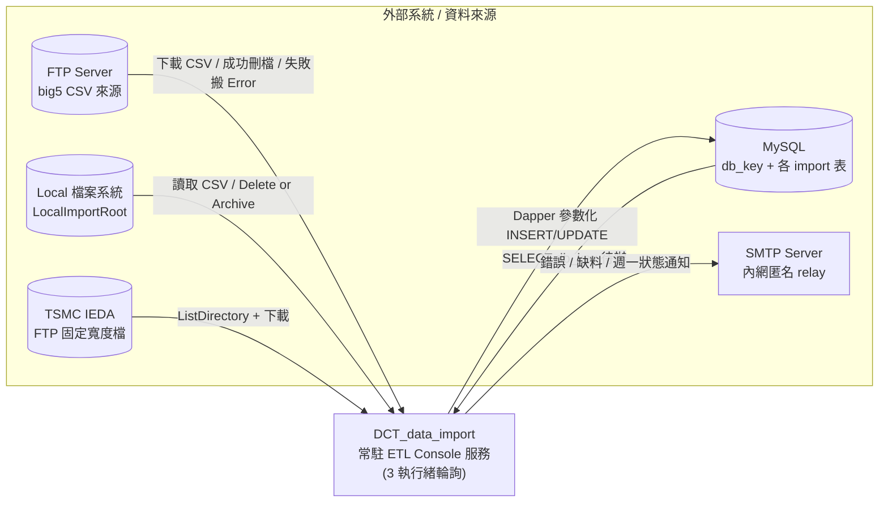
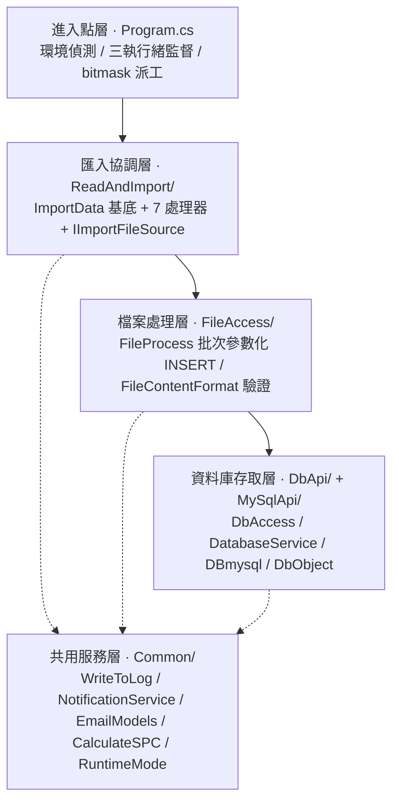
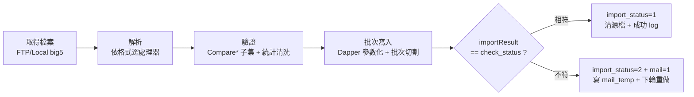
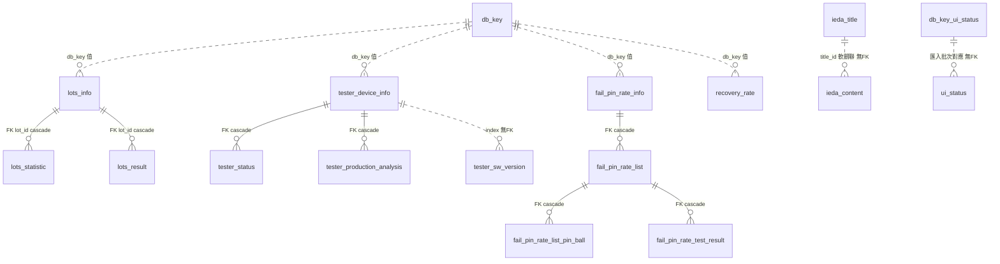

# DCT_data_import 專案架構報告

> **版本 3.0.0** · 最後更新 2026-06-30 · 對應原始碼狀態：`Stream F Task 5 typed-only DB result surface`
>
> 本版在 v2.5.0（A4 net8-only、S2 SQL 參數化、FTP/Local 來源切換、成功紀錄檔、log retention、TsmcIeda 路徑收斂、P2/P3 同步化、DB query/command result split）基礎上做**結構重整**：
> 1. **瘦身** — 與 `docs/codebase/` 七檔重複的工程細節（行數、方法清單、完整連線字串）改為摘要 + 連結，本報告聚焦「不知道就會踩雷」的隱性知識，工程細節以 `docs/codebase/` 為權威。
> 2. **新增** — 系統情境圖（§2）、資料模型 ER + CSV→表映射（§11）、詞彙表（§17），全部以 Mermaid 為單一真實來源（同款圖內嵌於 [`專案架構視覺化.html`](專案架構視覺化.html)，HTML 為衍生產物勿手改）。
>
> 歷史警示：v1.1.0（2025-08-12）曾與程式碼嚴重脫節（引用不存在的 `*Refactored.cs` / `DatabaseSchemaDefinitions.cs`、CheckStatus 位元順序相反、描述已不存在的 HTTP API / 自動建表 / 真實事務）。自 v2.0.0 起所有敘述以實際原始碼為準並標 `檔案:行` / git commit。

---

## 1. 這個系統做什麼

DCT_data_import 是一支 **SDK-style .NET 8 Console 應用程式**（`net8.0-windows`，`OutputType=Exe`），把半導體 **DCT（Direct Circuit Test）測試資料**從 FTP / 檔案系統自動匯入 MySQL。

核心流程：**從 FTP 或 LocalImportRoot 取得測試結果檔（big5 編碼）→ 依格式解析 → 驗證 → 批次寫入 MySQL → 成功時清理來源檔並寫 success log → 以旗標 `check_status` 判定該批是否完整匯入 → 失敗回寫 `mail` 旗標並寄通知信**。

程式啟動後進入**無限迴圈**，常駐三條工作執行緒輪詢待匯入資料，是長時間運行的背景匯入服務（非一次性 ETL 工具）。

---

## 2. 系統情境（System Context）

本服務在環境中的位置與外部接點。實線=資料/控制流向；外部系統設定皆來自 `App.config`（細節見 [`docs/codebase/INTEGRATIONS.md`](docs/codebase/INTEGRATIONS.md)）。



- **無使用者登入**（背景批次服務）；DB/FTP 用 `App.config` 明文帳密、SMTP 匿名 relay（憑證債見 §16 風險 1）。
- **同一份 binary 跨環境共用**：靠執行機本機 IP 切 Dev/Prod（見 §6）。

---

## 3. 技術棧（摘要）

| 項目 | 內容 |
|---|---|
| Runtime | **net8.0-windows** Console（Exe），單一 TFM（A4 後不再保留 net462 fallback） |
| 資料存取 | **MySql.Data 9.4.0 + Dapper 2.1.66**，直連 MySQL + parameters |
| JSON | Newtonsoft.Json 13.0.3（SELECT 結果以 `JArray` 承載） |
| 設定 | System.Configuration.ConfigurationManager 8.0.1 |
| 專案格式 | SDK-style csproj + PackageReference，`.cs` 由 SDK glob 自動納入（不需手維 `<Compile Include>`） |

> ⚠️ **組件版本寫死**：`AssemblyVersion 2026.2.5.0` 在 `Properties/AssemblyInfo.cs:33` 是靜態字面值（非自動戳記、非語意版本；csproj 設 `GenerateAssemblyInfo=false`），改版本要手改該行。
>
> 完整套件清單 / 版本 pin / TFM 細節見 [`docs/codebase/STACK.md`](docs/codebase/STACK.md)。

---

## 4. 整體架構

每層只依賴下層；`Common/` 為各層共用（虛線）。詳細模組職責表見 [`docs/codebase/ARCHITECTURE.md`](docs/codebase/ARCHITECTURE.md)。



**資料流**（單批 DB_Key 的處理）：



目錄結構（含每檔職責註解）見 [`docs/codebase/STRUCTURE.md`](docs/codebase/STRUCTURE.md)；資料夾即 namespace（`NamespaceConventionTests` 把關，新檔比照對齊）。

---

## 5. 進入點與三執行緒模型（Program.cs）

`Main` 啟動後進入**無限迴圈**，常駐**三條**工作執行緒（**不是兩條**；舊報告誤述為「Tester / TSMC 兩模式選擇」）：

| 執行緒方法 | 職責 |
|---|---|
| `ImportTesterMode` | RawData / Tester / FailPin / RecoveryRate / MultiSpec 等主要測試資料，並計算 check_status |
| `ImportUiStatusMode` | 獨立處理 UI 狀態（寫 `ui_status` 表，**不在 check_status 旗標內**） |
| `ImportTsmcMode` | TSMC IEDA 對接（固定寬度解析、寫 ieda_title/ieda_content） |

- **自我復活**：迴圈偵測死掉的執行緒，以 `RestartWorker` 重啟（`Thread.Interrupt()` → `new Thread(...)` → `Start()`）。`Thread.Abort()` 在 net5+ 已停用，僅保留註解說明為何不再呼叫。
- `ImportTsmcMode` **不讀 DB 的 DB_Key 清單**（與 Tester 模式不同，直接掃 FTP 目錄）。
- `Main` 啟動只輸出 HOST/USER 與 PASSWORD set/unset，**不印 PASSWORD 明文**；新增啟動輸出要維持遮罩（§16 風險 1/2）。

> 🐞 **單位陷阱**：`Thread.Sleep(432000)` 註解寫「2H」，但 432000 **毫秒** = 432 秒 = **7.2 分鐘**。實際輪詢週期是 7.2 分鐘，不是 2 小時。

---

## 6. 環境與資料來源切換

**靠執行機本機 IPv4 硬編碼判定，不是 build configuration**（`GetEnvironment` / `GetLocalIPAddress`）：

- `productionIps = {"10.16.92.67", "10.16.92.68"}` → 命中即 **Prod**，否則 **Dev**。
- 連線參數鍵以字串串接：`${Environment}Host`、`${Environment}UserName`… 對應 App.config 的 `DevHost`/`ProdHost` 等。Dev/Prod 共用同一 database 名 `dct`，差別只在 Host。
- FTP 根路徑分環境：Dev `/DCT_Log/DCT_DB_DATA_Dev/`、Prod `/DCT_Log/DCT_DB_DATA/`。

> ⚠️ **Release build 不會自動指向 Prod**——環境選擇是 runtime 邏輯，純看執行該程式的機器 IP（換機/換 IP 即失效，§16 風險 6）。

**資料來源（FTP / Local）**：`ImportFileSourceFactory.Create()` 依 `ImportSource` 建立來源——預設 `Ftp`；`Local` 時從 `LocalImportRoot` 讀同一套相對路徑，成功後依 `LocalSuccessAction` 決定 `Delete`（預設）或移到 `Imported/`。連線/路徑細節見 [`docs/codebase/INTEGRATIONS.md`](docs/codebase/INTEGRATIONS.md)。

### 6.1 影子驗證模式（DryRun）

`App.config` 的 `DryRun` appSetting（預設 `false`，缺 key 亦 fail-safe OFF）由 `Common/RuntimeMode.IsDryRun` 讀取。啟用後 ETL **只解析/驗證/比對，不對外做任何變更**：

- **DB 寫入全跳過**：`DBmysql.ExecuteCommand`（`DBmysql.cs:98`）在開連線前回 no-op 成功，涵蓋所有 INSERT/UPDATE/DELETE（含 §12 的破壞性多表 cascade delete）；SELECT 仍照常。
- **FTP / Local 檔案副作用全跳過**：不刪/不改名 FTP 檔、不搬移 Local 成功/失敗檔。
- **寄信跳過**：`EmailModels.SendEmail`（`EmailModels.cs:25`）直接回成功、不連網。
- **`mail_temp.txt` 保留**（`NotificationService` 不清暫存），供影子試跑後比對。

check_status / import_status 照常計算，只是結果不落地。用途：.NET 8 cutover 影子試跑與資料污染回滾防護。

---

## 7. 七個格式處理器（ReadAndImport/）

`ImportData.cs` 是**基底類別**：封裝 big5 編碼、`IImportFileSource` 來源操作（FTP/Local 的列目錄、讀檔、成功處置、錯誤搬移）、成功匯入紀錄與路徑組裝。以下 7 個處理器繼承它（舊報告誤列的 `*Refactored.cs` **全部不存在**）：

| 處理器 | 寫入表 | 關鍵隱性知識 |
|---|---|---|
| **RawData** | `lots_info` / `lots_statistic` / `lots_result` | `result` 代碼 `0`=檔案不存在（**唯一觸發 MultiSpec fallback 的條件**）/ `1`=成功 / `2`=格式錯 / `3`=重複或例外。`Customer=='TSMC'` 會呼叫 `TsmcIeda.GetNetNameList` |
| **MultiSpecRawData** | 同 RawData（多 site 共用單一 `lots_info`） | 僅在 RawData `result==0` 時啟用（commit `e30b06c` 收斂，避免誤觸）。⚠️ **多 site 某 site 失敗 → 前段已寫入不回滾（partial import）** |
| **Tester** | `tester_device_info` / `tester_status` / `tester_sw_version` / `tester_production_analysis` | 新增 **SWT result / SWT respond** 欄位；`CompareStatus` 用**子集驗證**相容新舊 CSV |
| **FailPin** | `fail_pin_rate_info` / `_list` / `_list_pin_ball` / `_test_result` | **SN Num 新舊相容**：新格式 `dataStartIndex=4`、舊 `=3`，以 `HasSnNum` 切換；測試結果以 `'@'` 分隔 |
| **RecoveryRate** | `recovery_rate` | 笛卡兒積展開 → `FinalRecoveryRateTable`（check_status 權重 8） |
| **UiStatus** | `ui_status` | 最簡單：無重複檢查、純同步、**獨立於 check_status 旗標** |
| **TsmcIeda** | `ieda_title` / `ieda_content` | **唯一固定寬度 `Substring` 解析、唯一純同步、唯一 `ListDirectory` 批次**。`lot_mapping.csv` → `ase_lot`（讀入記憶體快取，不寫獨立表）；IEDA/CSV/LotID 路徑已收斂到 `ImportData` / `IImportFileSource` helper |

各處理器方法清單與行數見 [`docs/codebase/STRUCTURE.md`](docs/codebase/STRUCTURE.md) 與 [`docs/codebase/ARCHITECTURE.md`](docs/codebase/ARCHITECTURE.md)。

---

## 8. CheckStatus 位元旗標模型（GROUND TRUTH）

判定「一筆 DB_Key 是否完整匯入」的核心機制。**舊報告位元順序完全相反且多加一位 UiStatus，本版為正確版本。**

### 8.1 4-bit 旗標（範圍 0–15）

| bit | 權重 | 子項 | 含義 |
|---|---|---|---|
| bit0 | 1 | **FailPin** | 失效針腳匯入成功 |
| bit1 | 2 | **RawData / TestResult** | 原始測試結果匯入成功 |
| bit2 | 4 | **Tester** | 機台狀態匯入成功 |
| bit3 | 8 | **RecoveryRate** | 回收率匯入成功（近期加入，commit `479f29e`） |

> **UiStatus 不在這個旗標內**（它走獨立的 `db_key_ui_status` 表 + `UpdateDbKeyUiStatusImportStatus`，公式 `importResult = uiStatus`）。舊報告的 bit4=UiStatus、CheckStatus=31 範例皆為錯誤。

### 8.2 判定公式（`DbAccess.ComputeImportResult`，`DbAccess.cs:179`）

```
importResult = 8 × recoveryRate + 4 × tester + 2 × testResult + 1 × failPin
```

- 每個子項**必須先正規化為 `Result == 1 ? 1 : 0`**——匯入函式的 `Result` 實際回 0/1/2/3，若不正規化，失敗碼 2/3 會讓加權和溢位、污染高位 bit。
- ⚠️ **不可改成 `Math.Min(x, 1)`**：那會把失敗碼 2/3 也映成 1、反把失敗當成功。
- **只有 `importResult == db_key.check_status` 時**才把 `import_status` 設 `1`（完整匯入）；`check_status` 是該 DB_Key **預期**要匯入的子項組合，不同產品/流程預期值不同。

> R5 修復原委（脆弱隱性契約、溢位恆判失敗、3 條 `_R5` 回歸樁）見 [`docs/codebase/CONCERNS.md`](docs/codebase/CONCERNS.md) 與 [`docs/codebase/ARCHITECTURE.md`](docs/codebase/ARCHITECTURE.md) Extended Sections。

---

## 9. 資料庫存取層

| 元件 | 角色 | 關鍵隱性知識 |
|---|---|---|
| `DbAccess` | 控制表存取 + check_status 計算 | 控制表 `db_key`（主控）/ `db_key_ui_status`；失敗清單寫 `mail_temp.txt` 再由 `SelectFailDbKeyFromFile()` 讀回 |
| `DatabaseService` | typed API + 存在性檢查 | `ExecuteQuery`→`DbQueryResult`、`ExecuteCommand`→`DbCommandResult`；`CheckDatabaseAndTableExists` **只檢查存在性、不自動建表**（舊報告所述 `DatabaseSchemaDefinitions.cs` / `Ensure*Async` 皆不存在） |
| `DBmysql` | Dapper 直連 + 連線單例 | 每次 `new MySqlConnection`；`MySqlConnectionManager` static `volatile`+`lock` 單次初始化，連線池 `Min5/Max100`；`FilterSqlCommand` 雙引號 regex 過濾為 S2 前殘留防線（見 §15） |
| `DbObject` | 輸入/回應契約 | `DbSqlRequest`(Query+Parameters)、`DbQueryResult`(JArray Data+Error)、`DbCommandResult`(AffectedRows+InsertId+Error) |

> ⚠️ **錯誤以 `Error` 字串傳遞，不拋例外**：呼叫端必須主動 `string.IsNullOrEmpty(response.Error)` 檢查，否則錯誤被靜默吞掉。typed split 後 SELECT 與 command 語意已分離。
>
> 📌 **現況是 Dapper 直連 MySQL，沒有外部 HTTP API Service**（舊報告所述「HTTP API 外部系統」、`ExecuteInsertWithAPI`、API dead config、「Web API body」註解皆已清理；Task 5 後 DB result surface 是 typed-only）。

---

## 10. 匯入引擎（FileProcess.cs）

全部 `Import*` 集中於此，是最大的單檔、扇入極高（動它前先列依賴方）。

- **S2 後 INSERT/DELETE 值走 Dapper parameters**：`FileProcess.ExecuteInsert` 統一接 `DynamicParameters`；SQL text 仍組 table / columns / placeholders，以 **identifier guard** 擋非法 table/column name。新增寫入路徑**不得繞過 `ExecuteInsert`**。
- **批次切割**（值寫死在程式、非 config，調整要改碼）：
  - `lots_statistic`：`cut_size = (test_count > 0 && test_count < 10000) ? 10000 / test_count : 1`
  - `recovery_rate` / `lots_result`：上限 5000 筆/批
  - `fail_pin`：50 筆/批
- 大型批次 INSERT values 已改用 `StringBuilder`（commit `b1aff2d`）；仍有部分小表/單筆路徑保留 `values += ...`。
- `ValidateAndConvertStatisticValue`：把 `stdev`/`avg`/`cp`/`cpk` 的異常值（`-1.#IND`、`1.#QNAN`）**轉為 0**（commit `479f29e`）。
- `tester_status` **只取第一列**。
- 「事務回滾」實為 best-effort cascade DELETE（見 §12）。

---

## 11. 資料模型

本服務寫入的匯入表與其關聯。**實線=FK `on delete cascade`；虛線=僅靠 index/欄位值的軟關聯（無 FK，刪父表不會自動連帶）**。完整 DDL 見 [`DCT_data_import/sql/dct.sql`](DCT_data_import/sql/dct.sql)。



> ⚠️ **`tester_sw_version`、`ieda_content`、`ui_status` 沒有 FK cascade**（只有 index / 欄位值軟關聯）。父表刪除**不會自動連帶刪除**它們，回滾完全依賴 app 端 DELETE 順序（見 §12）。`db_key` 是所有匯入根表的邏輯關聯鍵（每張根表帶 `db_key` 欄位回指控制表，非 FK）。

### 11.1 來源檔 → 處理器 → 資料表映射

| 來源檔（big5 CSV / 固定寬度） | 處理器 | 寫入表 | 觸發 check_status bit |
|---|---|---|---|
| 原始測試結果檔 | RawData | `lots_info` / `lots_statistic` / `lots_result` | bit1 (TestResult) |
| `test_result_site*_{dbKey}.csv`（多 site） | MultiSpecRawData | 同 RawData（共用 `lots_info`） | bit1 |
| 機台狀態檔 | Tester | `tester_device_info` / `tester_status` / `tester_sw_version` / `tester_production_analysis` | bit2 (Tester) |
| 失效針腳檔 | FailPin | `fail_pin_rate_info` / `_list` / `_list_pin_ball` / `_test_result` | bit0 (FailPin) |
| 回收率檔 | RecoveryRate | `recovery_rate` | bit3 (RecoveryRate) |
| UI 狀態檔 | UiStatus | `ui_status` | （不在 check_status，獨立 `db_key_ui_status`） |
| TSMC IEDA 固定寬度檔 + `lot_mapping.csv` | TsmcIeda | `ieda_title` / `ieda_content` | （獨立 pipeline，不讀 DB_Key 清單） |

> **控制表 `db_key`**（`DbAccess` 維護）：`check_status`（預期值）/ `import_status`（0 待處理 /1 完整 /2 不符）/ `mail`（待寄信）。`db_key_ui_status` 為 UI 狀態獨立控制表。寫入欄位細節見 [`docs/codebase/INTEGRATIONS.md`](docs/codebase/INTEGRATIONS.md) §2 Data Stores。

---

## 12. 錯誤回滾的真相：best-effort cascade DELETE

> **沒有真實 DB transaction 保護整個匯入單元。**失敗時以串接 DELETE 嘗試清掉已寫入資料，有兩個已知缺口：

1. **lots_result 失敗 → 殘留 orphan**：`lots_info` 與 `lots_statistic` 已先寫入，若 `lots_result` 失敗，DELETE 不一定清得乾淨。
2. **MultiSpec 多 site 失敗 → 部分匯入**：後段 site 失敗，**前段已成功的 site 不回滾**。

此外，**無 FK cascade 的子表（`tester_sw_version` / `ieda_content` / `ui_status`，見 §11）即使父表被刪也不會自動連帶**，更依賴 app 端 DELETE 順序正確。

也**沒有通用的重試/狀態復原機制**。唯一重試是 `TsmcIeda.GetNetNameList` 的一次性遞迴重試。狀態「復原」靠：`import_status` 標記 + 失敗回寫 `mail=1` + 7.2 分鐘迴圈下輪重撈未完成 DB_Key 重做。

---

## 13. 同步模型：明確同步阻塞

P2 後已移除 fake async 外殼，方法簽名與行為一致：importer 回 `ImportResult` 由 worker thread 直接呼叫；DB API 是同步 `ExecuteQuery`/`ExecuteCommand`；`DBmysql` 用同步 `MySqlConnection.Open` + Dapper。`WriteToLog` 也刻意用同步 `StreamWriter.WriteLine`（避免 `WriteLineAsync` fire-and-forget 丟日誌）。

> 這不是「真 async」改造；若未來要提升 I/O 併發，需另設計完整 async DB/FTP path。架構風險細節見 [`docs/codebase/CONCERNS.md`](docs/codebase/CONCERNS.md)。

---

## 14. 通知與日誌

- **NotificationService**：收件人從執行檔目錄 `dct_import_mail_list.ini` 的 `[mail_list]` 讀；**發信時窗硬編碼**——只在**週一 08:00–08:09** 回報平安（業務排程規則）。⚠️ **ui_status 失敗通知目前被註解停用**。
- **EmailModels**：純 SMTP 發送器，server/from 由 `App.config` 指定；**寄信前先 Ping server**，失敗即放棄（避免卡 SMTP timeout）。目前為內網匿名 relay、**無 SMTP auth/TLS**（環境決策非 hardcode）。`ToList` 以 null guard 處理空清單，不 NRE。
- **WriteToLog**（全專案最高扇入，改 public 簽名波及全庫）：日誌根目錄 `DataImportLogRoot`（預設 `C:\temp`）；`DataImportLogRetentionDays` 預設 90 天（retention cleanup，**非** size-based rotation）；跨程序 **Mutex** 鎖（WaitOne 逾時 30 秒吞例外、日誌可能靜默遺失）。⚠️ **UTF-8 BOM 不一致**：`WriteToDataImportLog`/`WriteToCheckLog` 用 `UTF8Encoding(true)` 修繁中亂碼（commit `ff028df`），但 `WriteToMailTemp` 仍用無 BOM 的 `Encoding.UTF8`。
- **CalculateSPC**：⚠️ `avg2` 存的是**平方平均 E[x²]**，非變異數；呼叫端須以 `avg2 - avg²` 再開根號才得標準差（母體標準差，除 N 非 N-1）。命名看不出此隱性契約；浮點誤差致根號內為負時 `Math.Sqrt(負)=NaN`、`Convert.ToDecimal(NaN)` 拋例外被外層 catch 吞掉。

各檔行數/方法清單見 [`docs/codebase/STRUCTURE.md`](docs/codebase/STRUCTURE.md)。

---

## 15. 近期變更與時間軸

> 完整 commit 歷史以 `git log` 為權威，本節只列影響理解的里程碑。

- **A4**：砍 net462 / 雙 TFM 腳手架，改 single `net8.0-windows`，capture 測試改 net8 硬斷言。
- **Task 5（`1d9e7f9` 起）**：DB query/command result split（`DbQueryResult` / `DbCommandResult`），caller migration 完成、移除舊 DB result adapter/API surface → DB result surface typed-only。
- **S2 SQL 參數化（`df90eee` / `e70e94a`）**：`DbAccess` / `TsmcIeda` / `FileProcess` 批次 INSERT 改 Dapper parameters；`ExecuteInsert` chokepoint 驗證 identifiers。
- **`0a9c2ae` FilterSqlCommand（雙引號 regex 過濾）**：S2 前字串串接時代的部分防護；**S2 後主寫入路徑改 parameters，此 filter 不再是值注入的主要防線**（殘留，勿當主要安全控制）。
- **`479f29e`**：統計異常值清洗（`-1.#IND`/`1.#QNAN`→0）+ `recovery_rate` 欄位 + check_status 權重 8。
- **`e30b06c`**：收斂 MultiSpec fallback 觸發條件（僅 RawData `result==0`）。
- **`15621ef` / `e195008`**：Tester SWT 欄位 / FailPin SN Num，皆子集驗證兼容新舊 CSV。
- **`5665721`**：匯入成功紀錄檔 `DCT_data_import_Success_Log_yyyy_MM_dd.txt`。
- **`ff028df`**：WriteToLog UTF-8 BOM 修繁中亂碼。
- **`bbe7e3c` / `fdf5727`**：TSMC IEDA 固定寬度 + RenameFile FTP 加固（Uri + 同主機 + UsePassive/Timeout）。
- **`06d90fe`**：移除 forced GC、清完 fake async path。

---

## 16. 已知風險與技術債

| # | 風險 | 位置 | 嚴重度 |
|---|---|---|---|
| 1 | **既有 DB/FTP secret 仍在 App.config 入版控**（S1，不得新增或擴大 secret 輸出） | `App.config` | 🔴 高 |
| 2 | 若新增啟動輸出可能誤印 secret；目前 PASSWORD 已遮罩 | `Program.cs` | 🟡 低 |
| 3 | **殘餘動態 SQL 組裝需維持 guard**：table/column/placeholder 仍由 FileProcess 組（值已 S2 參數化） | `FileProcess.cs` | 🟠 中 |
| 4 | **無真實 DB transaction**：cascade DELETE 留 orphan / partial import；部分子表無 FK cascade | `FileProcess.cs` / `MultiSpecRawData.cs` | 🟠 中 |
| 5 | 同步阻塞 I/O 模型（已移除 fake async，未改真 async/併發） | `DatabaseService.cs` / importer | 🟡 低 |
| 6 | **環境靠本機 IP 硬編碼判定**（換機/換 IP 即失效） | `Program.cs` | 🟠 中 |
| 7 | SMTP 仍為內網匿名 relay（server/from 已外部化） | `EmailModels.cs` / `App.config` | 🟡 低 |
| 8 | `Thread.Sleep(432000)` 註解誤標「2H」（實 7.2 分） | `Program.cs` | 🟡 低 |
| 9 | WriteToMailTemp 編碼與其他日誌不一致（無 BOM） | `WriteToLog.cs` | 🟡 低 |
| 10 | ui_status 失敗通知被註解停用 | `NotificationService.cs` | 🟡 低 |
| 11 | Log retention 只依天數清理，無 size-based rotation | `WriteToLog.cs` | 🟡 低 |

> 風險 1 為高風險既有設計。SQL 值注入已由 S2 參數化大幅收斂；新增 SQL 沿用 `DbSqlRequest.Parameters` / `ExecuteInsert` chokepoint，勿回到手動拼值。完整風險清單與緩解見 [`docs/codebase/CONCERNS.md`](docs/codebase/CONCERNS.md)。

---

## 17. 詞彙表（Glossary）

接手者不查就會誤解的領域 / 專案術語：

| 術語 | 意義 |
|---|---|
| **DCT** | Direct Circuit Test，半導體直接電路測試；本服務匯入其測試結果 |
| **DB_Key / db_key** | 一個待匯入批次的識別鍵；同時是控制表 `db_key` 與各匯入根表的邏輯關聯欄位 |
| **check_status** | 該 DB_Key **預期**要匯入哪些子項的 4-bit 旗標（0–15）；不同產品/流程預期值不同 |
| **importResult** | 實際匯入成功子項的加權和（§8 公式）；`== check_status` 才算完整 |
| **import_status** | 控制表狀態：`0` 待處理 / `1` 完整匯入 / `2` 不符（觸發寄信重做） |
| **mail（旗標）** | 控制表欄位，`1` 表該批待寄失敗通知信 |
| **ImportResult.Result** | importer 回傳碼：`0` 檔案不存在 / `1` 成功 / `2` 驗證或讀檔失敗 / `3` 重複或匯入失敗（各 importer 一致） |
| **MultiSpec / multi-site** | 同一批多個量測 site 各有檔案、共用單一 `lots_info`；僅 RawData `result==0` 時 fallback |
| **IEDA** | TSMC 端資料介面；TsmcIeda 以固定寬度解析、走獨立 pipeline |
| **ase_lot / lot_mapping** | `lot_mapping.csv` 讀入記憶體後映射成 `ieda_title.ase_lot` 欄（非獨立表） |
| **DryRun / 影子驗證** | 唯讀模式：解析比對照常、所有對外寫入（DB/FTP/Local/Email）轉 no-op（§6.1） |
| **big5** | 來源 CSV 的字元編碼；`Encoding.GetEncoding("big5")` 解析 |
| **recovery_rate / 回收率** | RecoveryRate 子項（check_status 權重 8），笛卡兒積展開後寫入 |
| **SPC / avg2** | 統計製程管制；`avg2` 是平方平均 E[x²] **非變異數**（§14） |
| **SWT** | Tester 新增的 result/respond 欄位（commit `15621ef`），子集驗證兼容新舊 CSV |
| **SN Num** | FailPin 序號欄位，新舊格式以 `dataStartIndex` 4/3 + `HasSnNum` 切換 |
| **Dev/Prod 路由** | 靠執行機本機 IP 切換（§6），非 build configuration |

---

## 18. 接手指南（Quick Start）

1. **先讀 §5（三執行緒）+ §8（CheckStatus）+ §12（回滾真相）** —— 理解系統行為的關鍵三節。
2. **環境判定看 §6**：本機 IP 是否在 `10.16.92.67/68` 決定連 Prod 還是 Dev；開發機預設走 Dev（localhost）。
3. **加新格式處理器**：繼承 `ImportData`、放 `ReadAndImport/`；新增 DB 寫入沿用 `DbSqlRequest.Parameters` / `ExecuteInsert`，新 caller 優先吃 `DbQueryResult` / `DbCommandResult`。
4. **動共用檔**（`WriteToLog` / `FileProcess` / `DbAccess`）：扇入極高，先確認所有呼叫端。
5. **build/test**：single `net8.0-windows` restore/build/test；runtime smoke 仍需 Windows + MySQL/FTP。
6. **debug 日誌**：`C:\temp\DCT_data_import\data_import_logs\`；成功紀錄同目錄 `DCT_data_import_Success_Log_yyyy_MM_dd.txt`（§14）。
7. **配套視覺化**：[`專案架構視覺化.html`](專案架構視覺化.html)（瀏覽器直開，含 CheckStatus 互動計算器）。
8. **工程細節權威來源**：[`docs/codebase/`](docs/codebase/) 七檔（STACK / STRUCTURE / ARCHITECTURE / CONVENTIONS / INTEGRATIONS / TESTING / CONCERNS）。

---

*本報告聚焦隱性知識，工程細節以 `docs/codebase/` 為權威來源。所有 Mermaid 圖為單一真實來源，同款內嵌於 `專案架構視覺化.html`（HTML 為衍生產物）。改架構時同步更新本報告與圖（diagram rot 視同 bug）。*
